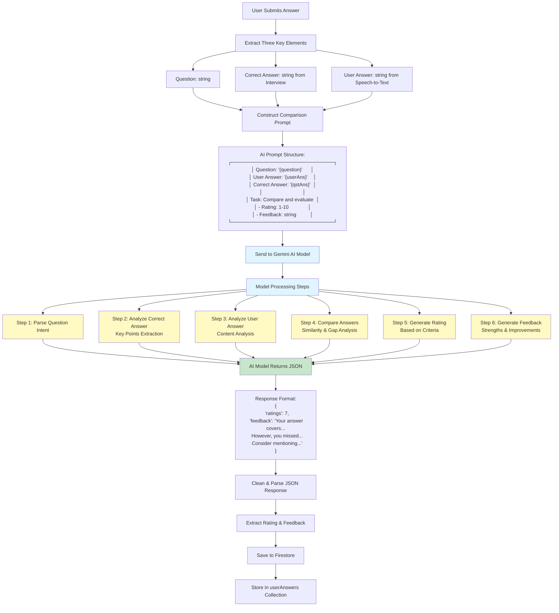
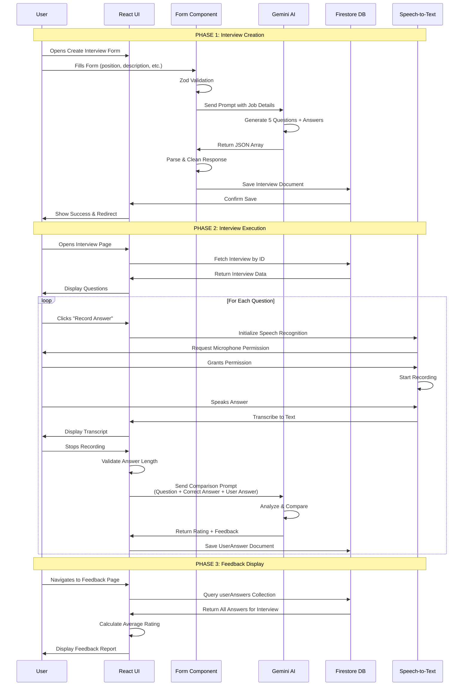

# AI Mock Interview System - Complete Data Flow Diagram

## Overview
This document provides a detailed step-by-step flowchart of how data flows through the system, what goes to the AI model, what comes back, and how feedback is generated.

---

## 1. INTERVIEW CREATION FLOW

### Flowchart: Creating a New Mock Interview

```mermaid
flowchart TD
    A[User Opens Create Interview Form] --> B[Form Fields Displayed]
    B --> C{User Fills Form}
    C --> D[Position: string]
    C --> E[Description: string]
    C --> F[Experience: number]
    C --> G[Tech Stack: string]
    
    D --> H[Zod Schema Validation]
    E --> H
    F --> H
    G --> H
    
    H --> I{Validation Passed?}
    I -->|No| J[Show Validation Errors]
    J --> C
    I -->|Yes| K[Call generateAiResponse Function]
    
    K --> L[Construct AI Prompt]
    L --> M["Prompt Template:<br/>Job Position: {position}<br/>Job Description: {description}<br/>Experience: {experience}<br/>Tech Stack: {techStack}<br/><br/>Generate 5 technical questions<br/>with answers in JSON format"]
    
    M --> N[Send Prompt to Gemini 2.5 Flash]
    N --> O[AI Model Processes Request]
    O --> P[Model Returns JSON Response]
    
    P --> Q[Response Format:<br/>Array of Objects<br/>[{question: string, answer: string}]]
    Q --> R[Clean AI Response]
    R --> S[Remove Markdown Code Blocks]
    S --> T[Parse JSON Array]
    T --> U{Valid JSON?}
    
    U -->|No| V[Show Error Toast]
    V --> C
    U -->|Yes| W[Save to Firestore]
    
    W --> X[Create Document in 'interviews' Collection]
    X --> Y[Fields Saved:<br/>- position<br/>- description<br/>- experience<br/>- techStack<br/>- questions: Array<br/>- userId: string<br/>- createdAt: Timestamp]
    
    Y --> Z[Show Success Toast]
    Z --> AA[Redirect to Dashboard]
    
    style N fill:#e1f5ff
    style O fill:#e1f5ff
    style P fill:#e1f5ff
    style Q fill:#c8e6c9
```

### Data Structure: What Goes to the Model

**Input to Gemini AI:**
```json
{
  "prompt": "As an experienced prompt engineer, generate a JSON array containing 5 technical interview questions along with detailed answers based on the following job information...",
  "jobInfo": {
    "position": "Full Stack Developer",
    "description": "Build web applications using React and Node.js...",
    "experience": 5,
    "techStack": "React, TypeScript, Node.js"
  },
  "model": "gemini-2.5-flash",
  "config": {
    "temperature": 1,
    "topP": 0.95,
    "topK": 40,
    "maxOutputTokens": 8192
  }
}
```

### Data Structure: What Comes from the Model

**Output from Gemini AI:**
```json
[
  {
    "question": "Explain the difference between let, const, and var in JavaScript",
    "answer": "let and const are block-scoped... var is function-scoped..."
  },
  {
    "question": "What is React's virtual DOM?",
    "answer": "The virtual DOM is a programming concept..."
  },
  // ... 3 more questions
]
```

---

## 2. INTERVIEW EXECUTION FLOW

### Flowchart: User Takes Mock Interview

```mermaid
flowchart TD
    A[User Navigates to Interview Page] --> B[Load Interview from Firestore]
    B --> C[Fetch Interview Document by ID]
    C --> D[Display Questions to User]
    
    D --> E[User Sees Question #1]
    E --> F{User Clicks Record Answer}
    
    F --> G[Initialize Speech Recognition]
    G --> H[Request Microphone Permission]
    H --> I{Permission Granted?}
    
    I -->|No| J[Show Error Message]
    I -->|Yes| K[Start Recording Audio]
    
    K --> L[Speech-to-Text Active]
    L --> M[User Speaks Answer]
    M --> N[Browser Speech API Transcribes]
    N --> O[Interim Results Displayed]
    O --> P[Final Transcript Generated]
    
    P --> Q{User Clicks Stop Recording}
    Q --> R[Validate Answer Length]
    R --> S{Answer > 30 chars?}
    
    S -->|No| T[Show Error: Answer too short]
    T --> F
    S -->|Yes| U[Call generateResult Function]
    
    U --> V[Prepare Comparison Data]
    V --> W["Input Data:<br/>- Question Text<br/>- Correct Answer from Interview<br/>- User's Transcribed Answer"]
    
    W --> X[Construct Comparison Prompt]
    X --> Y["Prompt Template:<br/>Question: '{question}'<br/>User Answer: '{userAnswer}'<br/>Correct Answer: '{correctAnswer}'<br/><br/>Compare and provide:<br/>- Rating 1-10<br/>- Feedback"]
    
    Y --> Z[Send to Gemini 2.5 Flash]
    Z --> AA[AI Model Analyzes Comparison]
    AA --> AB[Model Evaluates:<br/>- Answer Accuracy<br/>- Technical Depth<br/>- Completeness<br/>- Clarity]
    
    AB --> AC[Model Returns JSON Response]
    AC --> AD["Response Format:<br/>{<br/>  ratings: number 1-10,<br/>  feedback: string<br/>}"]
    
    AD --> AE[Parse JSON Response]
    AE --> AF[Save to Firestore]
    
    AF --> AG[Create Document in 'userAnswers' Collection]
    AG --> AH["Fields Saved:<br/>- question: string<br/>- correct_ans: string<br/>- user_ans: string<br/>- feedback: string<br/>- rating: number<br/>- mockIdRef: string<br/>- userId: string<br/>- createdAt: Timestamp"]
    
    AH --> AI{More Questions?}
    AI -->|Yes| AJ[Move to Next Question]
    AJ --> E
    AI -->|No| AK[All Answers Saved]
    AK --> AL[Redirect to Feedback Page]
    
    style Z fill:#e1f5ff
    style AA fill:#e1f5ff
    style AB fill:#e1f5ff
    style AC fill:#e1f5ff
    style AD fill:#c8e6c9
```



### Answer Comparison Process

**What is Used in Answer Comparison:**

1. **Question Text** - The original interview question
2. **Correct Answer** - The ideal answer generated during interview creation (stored in `interview.questions[].answer`)
3. **User Answer** - The transcribed speech-to-text response from the user

**Comparison Logic (Handled by AI Model):**
- Semantic similarity between user answer and correct answer
- Technical accuracy and depth
- Completeness of response
- Clarity and structure
- Relevance to the question asked

---

## 3. FEEDBACK GENERATION DETAILS

### Flowchart: Feedback Generation Process



### Rating Criteria (Inferred from AI Model Behavior)

The AI model evaluates answers based on:

1. **Accuracy (40%)** - How correct is the information?
2. **Completeness (30%)** - Does it cover all key points?
3. **Technical Depth (20%)** - Demonstrates understanding?
4. **Clarity (10%)** - Is it well-structured and clear?

**Rating Scale:**
- 9-10: Excellent - Comprehensive and accurate
- 7-8: Good - Covers most points with minor gaps
- 5-6: Average - Basic understanding, missing key details
- 3-4: Below Average - Significant gaps or inaccuracies
- 1-2: Poor - Major misunderstandings or incorrect

---

## 4. COMPLETE SYSTEM DATA FLOW

### End-to-End Flow Diagram



---

## 5. DATA STRUCTURES & TRANSFORMATIONS

### Input Data Transformation

**Form Input → AI Prompt:**
```
User Input:
{
  position: "Full Stack Developer",
  description: "Build React apps...",
  experience: 5,
  techStack: "React, TypeScript"
}

↓ Transformed to ↓

AI Prompt:
"As an experienced prompt engineer, generate a JSON array containing 5 
technical interview questions along with detailed answers based on the 
following job information:

Job Position: Full Stack Developer
Job Description: Build React apps...
Years of Experience Required: 5
Tech Stacks: React, TypeScript

The questions should assess skills in React, TypeScript development..."
```

### Output Data Transformation

**AI Response → Stored Data:**
```
AI Raw Response:
"```json
[
  {"question": "...", "answer": "..."},
  ...
]
```"

↓ Cleaned & Parsed ↓

Stored in Firestore:
{
  questions: [
    {question: "...", answer: "..."},
    ...
  ]
}
```

### Answer Comparison Data Flow

**Comparison Input:**
```
Question: "Explain React hooks"
Correct Answer: "React hooks are functions that let you use state..."
User Answer: "Hooks let you add state to functional components..."

↓ Sent to AI as Prompt ↓

"Question: 'Explain React hooks'
User Answer: 'Hooks let you add state...'
Correct Answer: 'React hooks are functions...'
Please compare and provide rating (1-10) and feedback."
```

**Comparison Output:**
```
AI Response:
{
  "ratings": 8,
  "feedback": "Your answer correctly identifies the core purpose of hooks. 
  However, you could mention that hooks must follow the Rules of Hooks 
  and cannot be called conditionally. Consider explaining useState and 
  useEffect as examples."
}

↓ Stored in Firestore ↓

{
  question: "Explain React hooks",
  correct_ans: "React hooks are functions...",
  user_ans: "Hooks let you add state...",
  feedback: "Your answer correctly identifies...",
  rating: 8
}
```

---

## 6. KEY TECHNICAL DETAILS

### Model Configuration Used

**For Question Generation:**
- Model: `gemini-2.5-flash`
- Temperature: 1 (creative, varied questions)
- Max Tokens: 8192
- Response Format: JSON array

**For Answer Comparison:**
- Same model configuration
- Temperature: 1 (allows nuanced evaluation)
- Response Format: JSON object with `ratings` and `feedback`

### Safety & Validation

1. **Input Validation:**
   - Zod schema validation on form inputs
   - Answer length validation (minimum 30 characters)
   - JSON parsing with error handling

2. **Output Validation:**
   - JSON structure validation
   - Markdown code block removal
   - Error fallbacks for invalid responses

3. **AI Safety:**
   - Content safety filters enabled
   - Medium+ threshold blocking for harmful content
   - Error handling for API failures

---

## 7. STORAGE SCHEMA

### Firestore Collections

**`interviews` Collection:**
```typescript
{
  id: string (auto-generated)
  position: string
  description: string
  experience: number
  techStack: string
  userId: string (from Clerk)
  questions: Array<{
    question: string
    answer: string
  }>
  createdAt: Timestamp
  updateAt: Timestamp
}
```

**`userAnswers` Collection:**
```typescript
{
  id: string (auto-generated)
  mockIdRef: string (references interview.id)
  question: string
  correct_ans: string
  user_ans: string
  feedback: string
  rating: number (1-10)
  userId: string (from Clerk)
  createdAt: Timestamp
  updateAt: Timestamp
}
```

---

## Summary

**Data Flow Summary:**
1. **User Input** → Form validation → **AI Prompt** → **AI generates questions**
2. **Questions** → Stored in Firestore → Displayed to user
3. **User speaks** → Speech-to-text → **Transcribed answer**
4. **Question + Correct Answer + User Answer** → **AI comparison** → **Rating + Feedback**
5. **Feedback** → Stored in Firestore → Aggregated and displayed

**Key Points:**
- AI is used twice: once for question generation, once for answer evaluation
- All AI interactions use the same Gemini 2.5 Flash model instance
- Data flows through Firestore for persistence
- Real-time updates via Firestore listeners on dashboard
- User answers are compared against AI-generated "correct" answers

